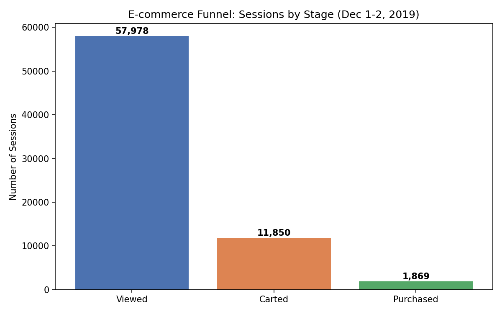

# E-commerce Funnel Drop-off Analysis

Analyzing where and why users drop off across the online purchase funnel, using real event-level e-commerce data.

## Problem Statement
Where in the customer journey — from viewing a product to completing a purchase — do the biggest drop-offs happen, and what factors (price, time of day) are associated with lower conversion?

## Dataset
- **Source:** [eCommerce Events History in Cosmetics Shop](https://www.kaggle.com/datasets/mkechinov/ecommerce-events-history-in-cosmetics-shop) (Kaggle, REES46 Marketing Platform)
- **Scope used:** December 1–2, 2019 (2-day sample, 262,220 events)
- **Columns:** event_time, event_type (view/cart/remove_from_cart/purchase), product_id, price, user_id, user_session

## Method
- Cleaned and filtered the raw event log using Python (pandas) in Google Colab
- Loaded cleaned data into a SQLite database
- Wrote SQL queries to calculate funnel counts, drop-off percentages, and segment-level conversion (see `/sql`)

## Key Findings

**1. Funnel drop-off**
- 57,978 sessions viewed a product → 11,850 added to cart (**79.6% drop-off**) → 1,869 completed a purchase (**84.2% drop-off** from cart)
- Overall conversion (view → purchase): **3.2%**

**2. Price segmentation**
Cheaper items had *higher* cart abandonment than mid-priced items — the opposite of the common assumption that expensive items get abandoned more:
| Price Band | Drop-off Rate |
|---|---|
| Under $5 | 82.2% |
| $5–15 | 77.6% |
| $15–30 | 71.0% |
| Over $30 | 78.1% |

**3. Time-of-day pattern**
Conversion was strongest at **7 AM (82.0% drop-off, lowest of the day)**, while early morning hours (4–5 AM) had the weakest conversion (89–90% drop-off), though on smaller sample sizes.

## Recommendation
- Investigate why low-priced items are abandoned more — possibly impulsive, low-intent cart additions rather than serious purchase intent. Consider targeted incentives (bundle discounts, free shipping thresholds) for sub-$15 items.
- Since 7 AM shows the strongest conversion, consider testing whether ad spend or push notifications timed around this window improve overall conversion.

## Repo Structure
- `/data` — cleaned dataset sample
- `/sql` — SQL queries used for the analysis
- `/notebooks` — full Python/Colab notebook
- `/dashboard` — funnel visualization
